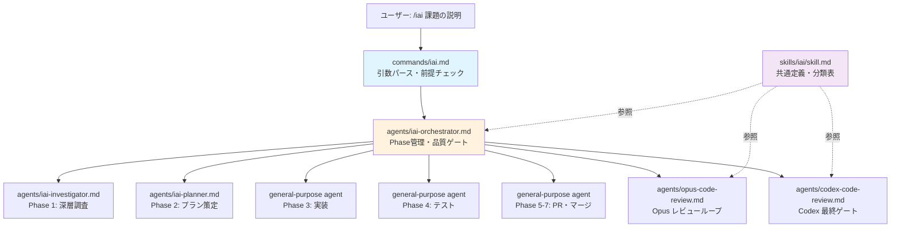
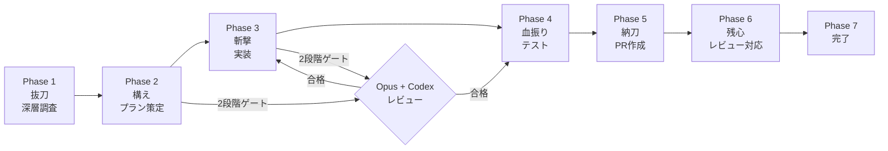
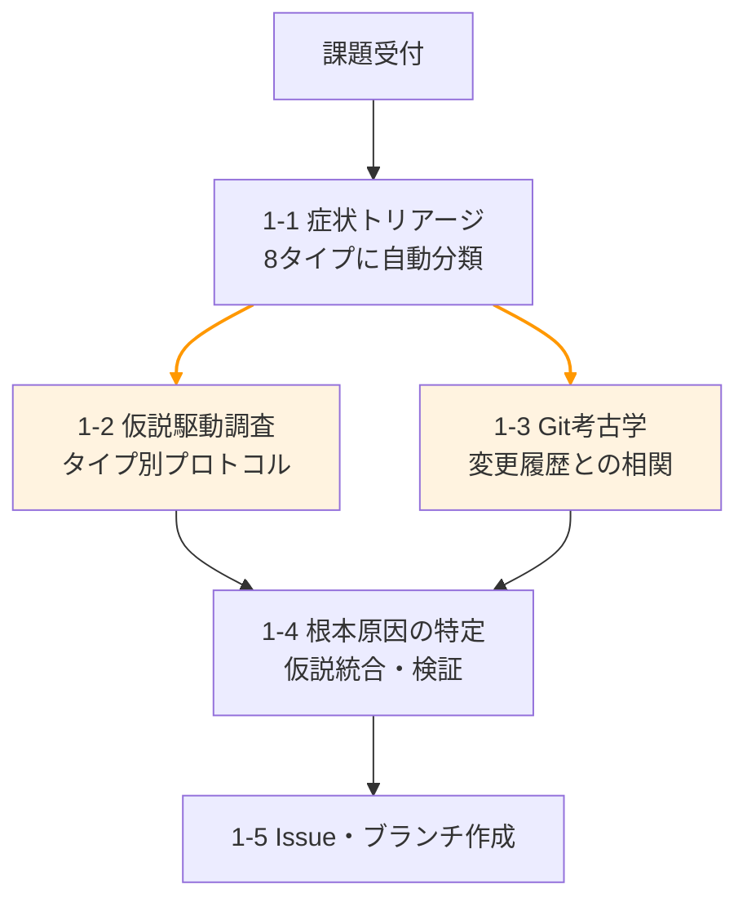

# /iai — 居合

> 抜いて、斬って、納める。一つの流れで課題を解決する。

課題を一言伝えるだけで、Issue作成 → プラン策定 → マルチLLMレビュー → 実装 → テスト → PR → マージまでを自動実行する Claude Code スキル。

## 特徴

- **シニアエンジニアの調査メソドロジー**: 症状トリアージ → 仮説駆動調査 → Git履歴調査 → 根本原因特定の4段階深層調査
- **課題タイプ別調査プロトコル**: CRASH / WRONG_DATA / SLOW / INTERMITTENT / UI_BROKEN / INTEGRATION / NEW_FEATURE / REFACTOR の8タイプ
- **マルチLLMレビュー**: Claude Opus（反復ループ） + Codex CLI（最終ゲート）の2段階品質チェック
- **エージェント組織体制**: 調査・プラン・実装・レビュー・テスト・PR を専門サブエージェントに委譲
- **コンテキスト保護**: Command → Agent → Skill パターンで必要な時に必要な定義だけをロード
- **チェックポイント復旧**: 中断しても前回のPhaseから再開可能
- **通常/全自動モード**: 確認しながら or `--auto` で一気通貫

## 使い方

### 1. インストール

```bash
# プロジェクトの .claude/ ディレクトリにコピー
cp -r .claude/commands/ <your-project>/.claude/commands/
cp -r .claude/skills/iai/ <your-project>/.claude/skills/iai/
cp -r .claude/agents/ <your-project>/.claude/agents/
cp -r .claude/rules/ <your-project>/.claude/rules/
```

### 2. 前提ツール

```bash
npm i -g @openai/codex    # Codex CLI
brew install gh            # GitHub CLI
```

### 3. パーミッション設定（推奨）

`settings.json.example` を参考に、`.claude/settings.json` を設定:

```bash
cp .claude/settings.json.example <your-project>/.claude/settings.json
```

### 4. プロジェクトに最適化

**[CUSTOMIZATION.md](CUSTOMIZATION.md)** に詳細なカスタマイズガイドがあります。最低限やるべきことは:

1. `.claude/rules/review.md` にプロジェクト固有のレビュールールを追加
2. テスト・ビルドコマンドをプロジェクトに合わせて確認
3. （任意）コーディングルール・テストルールを追加

言語別の設定例（React, Python, Go, Swift）は [CUSTOMIZATION.md](CUSTOMIZATION.md) を参照。

### 5. 実行

```bash
# 通常モード（確認しながら）
/iai ダッシュボードのグラフが表示されない

# 全自動モード（マージまで一気に）
/iai --auto ログインボタンが反応しない
```

## アーキテクチャ

### Command → Agent → Skill パターン



### ファイル構成

```
.claude/
├── commands/
│   └── iai.md                  # エントリポイント（軽量）
├── skills/
│   └── iai/
│       └── skill.md            # 共通定義（課題タイプ表・レビュー基準）
├── agents/
│   ├── iai-orchestrator.md     # Phase 1〜7 進行管理
│   ├── iai-investigator.md     # Phase 1 深層調査プロトコル
│   ├── iai-planner.md          # Phase 2 プラン策定
│   ├── codex-code-review.md    # Codex CLI レビュー（最終ゲート）
│   └── opus-code-review.md     # Claude Opus レビュー（反復ループ）
├── rules/
│   └── review.md               # レビュールール（カスタマイズ用）
└── settings.json.example       # パーミッション・Hooks 設定サンプル
```

### コンテキスト効率

| 旧構成 | 新構成 |
|--------|--------|
| skill.md 1ファイル（34KB）が毎回全ロード | skill.md（4KB）+ 必要なエージェントのみロード |
| コンテキストの3-5%を常時消費 | 必要時のみ0.5-2%消費 |

## ワークフロー



### Phase 1 深層調査の流れ



> ※ 1-2 と 1-3 は並列実行

### 2段階レビューゲート

```
Claude Opus ループ（安い・反復向き）
    ↓ P0/P1 なしで合格
Codex CLI 最終ゲート（高い・外部視点・1回のみ）
    ↓ 合格 → 次の Phase へ
    ↓ 不合格 → Claude Opus ループに戻る
```

## Devin Review（推奨）

Phase 6 の「レビュー監視」は、PRに対して外部レビューが届くことを前提としています。
[Devin Review](https://devin.ai/) の利用を想定しており、PR作成後に Devin がレビューコメントを投稿するのを待ち、指摘があれば自動で修正・再プッシュします。

Devin Review を使わない場合は、Phase 6 のレビュー監視をスキップするか、他のレビューbot に合わせてカスタマイズしてください。

## ライセンス

MIT
