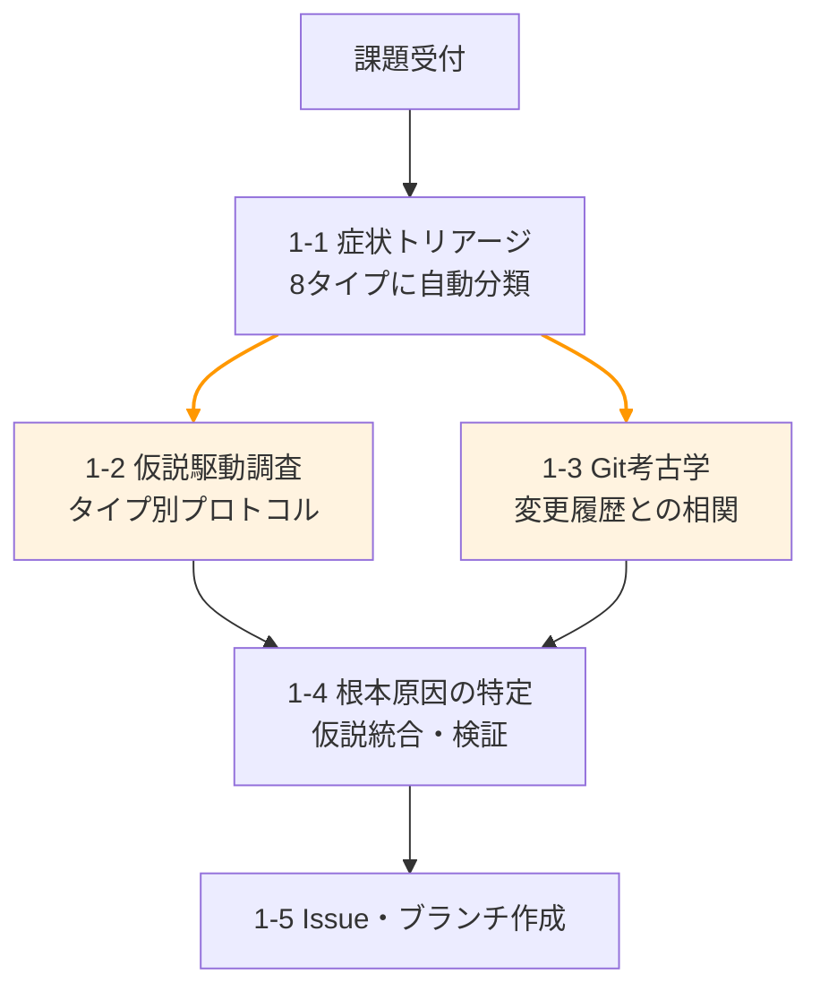

# /iai — 居合 v2

> 抜いて、斬って、納める。一つの流れで課題を解決する。

課題を一言伝えるだけで、Issue作成 → プラン策定 → テスト設計 → 実装 → 検証 → PR → マージまでを自動実行する Claude Code スキル。

## v2 の主要変更点

- **エンジニアチーム型アーキテクチャ**: 統括リーダーはコードを読まず、handoff artifact + diff --stat + Codex verdict のみで判断
- **Codex CLI 4値 Verdict**: PASS / FAIL / ERROR / SKIPPED の明確な状態管理。fail-closed 原則（ERROR は合格扱い禁止）
- **6軸プラン品質スコアカード**: 完全性・最小性・リスク・テスト戦略・依存整理・観測可能性
- **構造化 Handoff Artifact**: Phase間の受け渡しを JSON schema で固定
- **Phase 0 Preflight**: codex / gh / node の存在確認 + Codex 認証確認 + ベースラインテスト
- **input_type 分岐**: Codex レビューが plan モード（Phase 2）と diff モード（Phase 4）に対応
- **テスト駆動開発**: テストを先に書き、AI にはテストを通す実装を書かせる

## 特徴

- **シニアエンジニアの調査メソドロジー**: 症状トリアージ → 仮説駆動調査 → Git履歴調査 → 根本原因特定の4段階深層調査
- **課題タイプ別調査プロトコル**: CRASH / WRONG_DATA / SLOW / INTERMITTENT / UI_BROKEN / INTEGRATION / NEW_FEATURE / REFACTOR の8タイプ
- **マルチLLMレビュー**: Claude Opus（反復ループ） + Codex CLI（最終ゲート）の2段階品質チェック
- **エージェント組織体制**: 統括リーダーがチームを指揮し、実装・レビュー・テストを専門サブエージェントに委譲
- **コンテキスト保護**: Command → Agent → Skill パターンで必要な時に必要な定義だけをロード
- **チェックポイント復旧**: 中断しても前回のPhaseから再開可能
- **通常/全自動モード**: 確認しながら or `--auto` で一気通貫

## 使い方

### 1. インストール

```bash
# プロジェクトの .claude/ ディレクトリにコピー
cp -r .claude/commands/ <your-project>/.claude/commands/
cp -r .claude/skills/iai/ <your-project>/.claude/skills/iai/
cp -r .claude/agents/ <your-project>/.claude/agents/
cp -r .claude/rules/ <your-project>/.claude/rules/
```

### 2. 前提ツール

```bash
npm i -g @openai/codex    # Codex CLI
brew install gh            # GitHub CLI
```

> Phase 0 Preflight で codex / gh / node の存在確認 + Codex 認証確認が自動実行されます。

### 3. パーミッション設定（推奨）

`settings.json.example` を参考に、`.claude/settings.json` を設定:

```bash
cp .claude/settings.json.example <your-project>/.claude/settings.json
```

### 4. プロジェクトに最適化

**[CUSTOMIZATION.md](CUSTOMIZATION.md)** に詳細なカスタマイズガイドがあります。最低限やるべきことは:

1. `.claude/rules/review.md` にプロジェクト固有のレビュールールを追加
2. テスト・ビルドコマンドをプロジェクトに合わせて確認
3. （任意）コーディングルール・テストルールを追加

言語別の設定例（React, Python, Go, Swift）は [CUSTOMIZATION.md](CUSTOMIZATION.md) を参照。

### 5. 実行

```bash
# 通常モード（確認しながら）
/iai ダッシュボードのグラフが表示されない

# 全自動モード（マージまで一気に）
/iai --auto ログインボタンが反応しない
```

## アーキテクチャ

### エンジニアチーム型

```
🧠 統括リーダー（iai-orchestrator）
│  見るもの: handoff artifact・diff --stat・Codex verdict のみ
│  やること: 組織化・遷移判断・ユーザー対話
│  やらない: コード読み・コード書き・詳細レビュー
│
├─ Phase 0: Preflight（環境チェック）
│
├─ Phase 1: 🔍 調査チーム
│  ├── investigator → 構造化 artifact を返す
│  └── git-archaeologist → Git調査サマリーを返す
│
├─ Phase 2: 📋 設計チーム（内部で品質ループを完結）
│  └── planner → 6軸スコアカード合格済みプランを返す
│  → Codex最終ゲート（input_type: plan）
│
├─ Phase 3-4: 💻 実装チーム（内部で品質ループを完結）
│  ├── test-designer → テスト作成（Red確認済み）
│  └── implementer(s) → ファイル所有権制で並列実装
│  → Codex最終ゲート（input_type: diff）→ 敵対的検証
│
├─ Phase 5-6: 🚀 リリースチーム
│  └── PR作成 → レビュー監視 → マージ
│
└─ Phase 7: 完了報告
```

### 情報フロー制約

| 役割 | 見るもの | 見ないもの |
|------|---------|-----------|
| **統括リーダー** | handoff artifact, diff --stat, Codex verdict | ファイル内容, 実コード |
| **実装チーム** | 全コード, テスト結果, Opusレビュー | 他チームの内部状態 |
| **Codexレビュアー** | git diff全文, レビュー観点 | 実装過程の試行錯誤 |
| **Verifier** | plan artifact, diff, test results | 実装者の意図 |

### Verdict 統一 Enum

| Verdict | 意味 | Phase遷移 |
|---------|------|----------|
| **PASS** | 成功 & P0/P1 なし | OK |
| **FAIL** | 成功 & P0/P1 あり | 修正ループ |
| **ERROR** | 実行不能/タイムアウト | **停止 + ユーザー判断** |
| **SKIPPED** | diff/入力が空 | PASS扱い |
| **PARTIAL** | 一部未検証（Verifierのみ） | ユーザー判断 |

> **fail-closed 原則**: ERROR は絶対に合格扱いしない。checkpoint保存して停止する。

### ファイル構成

```
.claude/
├── commands/
│   └── iai.md                  # エントリポイント（引数パース・前提チェック）
├── skills/
│   └── iai/
│       └── skill.md            # 共通定義（チーム構成・スコアカード・Verdict定義）
├── agents/
│   ├── iai-orchestrator.md     # Phase 0〜7 進行管理・品質ゲート
│   ├── iai-investigator.md     # Phase 1 深層調査プロトコル
│   ├── iai-planner.md          # Phase 2 プラン策定（6軸スコアカード内蔵）
│   ├── iai-verifier.md         # Phase 4 敵対的検証（壊しにいく）
│   ├── codex-code-review.md    # Codex CLI 最終ゲート（4値verdict）
│   └── opus-code-review.md     # Claude Opus レビューループ（チーム内部用）
├── rules/
│   └── review.md               # レビュールール（カスタマイズ用）
└── settings.json.example       # パーミッション・Hooks 設定サンプル
```

### 6軸プラン品質スコアカード

プランナーが内部で全軸合格するまでループし、合格して初めて統括リーダーに返す。

| 軸 | チェック内容 | 合格条件 |
|----|------------|---------|
| **完全性** | 受け入れ条件→テストケース変換可能か | 全条件カバー |
| **最小性** | スコープクリープなし | 変更ファイル≤10 |
| **リスク** | ロールバック手順が明記されているか | 手順あり |
| **テスト戦略** | Red→Green のケース設計 | 正常/境界/異常 各1+ |
| **依存整理** | ステップ間依存が明確 | 循環依存なし |
| **観測可能性** | 問題検知のログ・テスト手段が明記されているか | 検知手段あり |

## ワークフロー

```
Phase 0 準備: Preflight（codex, gh, node, 認証, ベースラインテスト確認）
Phase 1 抜刀: 症状トリアージ → 仮説駆動調査 → Git履歴調査 → 根本原因特定 → Issue作成
Phase 2 構え: プラン策定（6軸スコアカード） → Codex最終ゲート（plan）
Phase 3 血振り: テスト設計・作成（Red） → テストレビュー → 失敗を確認
Phase 4 斬撃: 実装（Green） → Codex最終ゲート（diff） → 敵対的検証
Phase 5 納刀: PR作成
Phase 6 残心: レビュー監視 → 対応 → マージ
Phase 7 完了: サマリー報告
```

### 2段階レビューゲート

```
チーム内 Opus ループ（安い・反復向き）
    ↓ P0/P1 なしで合格
統括リーダーが Codex CLI 最終ゲート起動（外部視点・1回のみ）
    ↓ PASS → 次の Phase へ
    ↓ FAIL → チームに差し戻し → Opus ループから再開
    ↓ ERROR → 停止 + ユーザー判断
```

### Phase 1 深層調査の流れ



> ※ 1-2 と 1-3 は並列実行

## Devin Review（推奨）

Phase 6 の「レビュー監視」は、PRに対して外部レビューが届くことを前提としています。
[Devin Review](https://devin.ai/) の利用を想定しており、PR作成後に Devin がレビューコメントを投稿するのを待ち、指摘があれば自動で修正・再プッシュします。

Devin Review を使わない場合は、Phase 6 のレビュー監視をスキップするか、他のレビューbot に合わせてカスタマイズしてください。

## ライセンス

MIT
